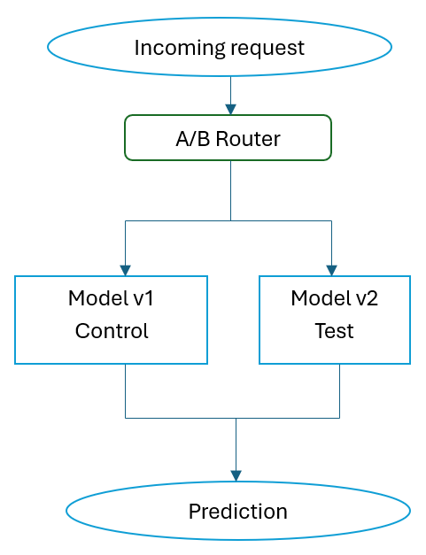

# A/B-тестирование моделей

## 1. Цель A/B-теста

Цель A/B-теста — сравнить две версии модели прогнозирования дефолта:

* **Model v1** — текущая модель, используемая в качестве контрольной группы;
* **Model v2** — новая версия модели, которую необходимо проверить перед переходом в production.

Основная задача эксперимента — определить, обеспечивает ли Model v2 более высокое качество прогнозирования и лучший бизнес-результат по сравнению с Model v1.

---

## 2. Разделение трафика

Для эксперимента используется случайное распределение клиентов между двумя группами в соотношении **50/50**.



При поступлении нового запроса A/B-router случайным образом выбирает одну из двух моделей.

Например:

```text
Random number < 0.5 → Model v1
Random number >= 0.5 → Model v2
```

Важно, чтобы один и тот же клиент во время эксперимента всегда попадал в одну группу. Для этого вместо полностью случайного выбора на каждый запрос можно использовать стабильное хеширование идентификатора клиента:

```text
hash(client_id) % 100 < 50 → v1
hash(client_id) % 100 >= 50 → v2
```

Это предотвращает ситуацию, когда один и тот же клиент сегодня обслуживается моделью v1, а следующий запрос отправляется модели v2.

---

## 3. Контрольная и тестовая группы

### Control — Model v1

Model v1 является текущей версией модели и используется как baseline.

Для неё уже получены следующие результаты:

```text
Accuracy:   0.8077
Precision:  0.6868
Recall:     0.2396
F1:         0.3553
ROC-AUC:    0.7076
```

Эти значения используются как исходная точка для сравнения с Model v2.

### Test — Model v2

Model v2 представляет новую версию модели или новую конфигурацию существующего алгоритма.

После завершения эксперимента её результаты сравниваются с результатами Model v1.

---

## 4. Продолжительность эксперимента

Для учебного проекта предлагается продолжительность A/B-теста **14 дней**.

Двух недель достаточно для демонстрации полного цикла эксперимента:

```text
День 1
  ↓
Запуск A/B-теста
  ↓
Дни 1–14
  ↓
Сбор предсказаний и фактических результатов
  ↓
День 14
  ↓
Статистический анализ
  ↓
Выбор модели
```

В реальной банковской системе продолжительность должна определяться не только календарным периодом, но и количеством накопленных наблюдений. Особенно важно дождаться момента, когда для достаточного количества клиентов станет известен фактический результат — произошёл дефолт или нет.

Поэтому практический критерий окончания эксперимента может быть сформулирован как:

> A/B-тест проводится не менее 14 дней и завершается после накопления статистически достаточного количества наблюдений для обеих групп.

---

## 5. Что собирается во время эксперимента

Для каждого запроса необходимо сохранять информацию, позволяющую позднее сравнить модели:

```text
request_id
client_id
model_version
prediction
default_probability
timestamp
```

После того как станет известен фактический результат, добавляется:

```text
actual_default
```

Например:

```json
{
  "request_id": "12345",
  "model_version": "v2",
  "prediction": 1,
  "default_probability": 0.73,
  "actual_default": 1
}
```

На основе этих данных формируются метрики отдельно для v1 и v2.

---

## 6. Условия проведения эксперимента

Для корректного сравнения необходимо, чтобы группы были максимально сопоставимыми.

Поэтому:

* распределение должно быть случайным;
* обе модели должны получать сопоставимые группы клиентов;
* модели должны работать с одинаковым набором входных признаков;
* период эксперимента должен быть одинаковым для обеих групп;
* правила обработки результатов должны быть одинаковыми;
* необходимо фиксировать версию модели для каждого запроса.

Главное условие эксперимента:

> Единственным существенным различием между контрольной и тестовой группами должна быть версия ML-модели.

---

## 7. Критерий предварительного выбора модели

После завершения A/B-теста результаты Model v1 и Model v2 сравниваются по техническим и бизнес-метрикам.

Например:

```text
                 Model v1      Model v2
F1                 0.3553        0.39
Precision          0.6868        0.67
Recall             0.2396        0.31
Expected Loss      baseline      -8%
```

Model v2 может быть рекомендована к дальнейшему использованию, если она демонстрирует статистически значимое улучшение основной метрики и при этом не приводит к неприемлемому ухудшению бизнес-показателей.

Таким образом, A/B-тест позволяет не заменять текущую модель сразу, а сначала проверить новую версию на части реального трафика и принять решение на основании экспериментальных данных.


# 2. Метрики и статистический анализ A/B-теста

## 2.1. Основная метрика — F1-score

Основной метрикой эксперимента выбирается **F1-score для класса дефолта (`default = 1`)**.

F1-score является гармоническим средним Precision и Recall:

```text id="9h2pxh"
F1 = 2 × Precision × Recall
     -------------------------
       Precision + Recall
```

Использование F1-score оправдано тем, что классы в датасете несбалансированы: клиентов без дефолта существенно больше, чем клиентов с дефолтом.

В текущей модели v1:

```text id="j1s3m2"
Precision = 0.6868
Recall    = 0.2396
F1        = 0.3553
```

Поэтому простое использование Accuracy было бы недостаточно информативным. Например, модель может получить высокую Accuracy преимущественно за счёт правильной классификации клиентов без дефолта, одновременно плохо обнаруживая клиентов с дефолтом.

Цель A/B-теста — определить, улучшает ли Model v2 F1-score по сравнению с Model v1.

---

## 2.2. Дополнительная метрика — Recall

В качестве дополнительной метрики выбирается **Recall для класса дефолта**.

Recall показывает долю реальных дефолтов, которые модель смогла обнаружить:

```text id="k0j9kg"
Recall = TP / (TP + FN)
```

где:

* `TP` — корректно обнаруженные дефолты;
* `FN` — дефолты, которые модель не обнаружила.

Для кредитного скоринга Recall имеет важное значение, поскольку пропуск потенциально проблемного клиента может привести к финансовым потерям банка.

В текущей модели:

```text id="2jyyv6"
Recall = 0.2396
```

Это означает, что модель обнаруживает примерно **23.96% реальных дефолтов**.

При этом увеличение Recall не должно происходить за счёт чрезмерного роста количества ошибочно отклонённых клиентов. Поэтому Recall необходимо рассматривать совместно с Precision и бизнес-метриками.

---

# 2.3. Статистический анализ

Для сравнения моделей необходимо определить, является ли наблюдаемое различие статистически значимым или оно могло возникнуть случайно.

Поскольку для каждого клиента имеется бинарный результат классификации, а итоговые метрики F1 и Recall являются долями, для учебного A/B-теста можно использовать **z-test для сравнения пропорций**.

Однако есть важная особенность: F1-score напрямую не является простой пропорцией. Поэтому статистический анализ F1 рекомендуется выполнять методом **bootstrap**, а z-test использовать для Recall.

Таким образом:

* для **Recall** используется z-test для сравнения пропорций;
* для **F1-score** используются bootstrap-доверительные интервалы и сравнение распределения разницы F1.

Это является более корректным подходом, чем применять обычный t-test непосредственно к одному значению F1 каждой модели.

---

# 2.4. Z-test для Recall

Для каждой модели формируется таблица:

```text id="t7bgp4"
                  Predicted Default

                 Yes          No
Actual Yes       TP           FN
Actual No        FP           TN
```

Recall рассчитывается как:

```text id="m7rj2s"
Recall = TP / (TP + FN)
```

Для сравнения Recall двух групп используется z-test для двух пропорций.

Нулевая гипотеза:

```text id="6h0d5e"
H0: Recall_v1 = Recall_v2
```

Альтернативная гипотеза:

```text id="2e6p3q"
H1: Recall_v1 ≠ Recall_v2
```

Используется уровень значимости:

```text id="d6w3y5"
α = 0.05
```

Если `p-value < 0.05`, нулевая гипотеза отвергается, и различие между Recall моделей считается статистически значимым.

---

# 2.5. Доверительный интервал для Recall

Для Recall можно построить **95% доверительный интервал**.

Например, результаты могут выглядеть следующим образом:

```text id="m39x1k"
Model v1:
Recall = 0.240
95% CI = [0.218; 0.263]

Model v2:
Recall = 0.310
95% CI = [0.285; 0.336]
```

Если различие между моделями статистически значимо, можно сделать вывод, что изменение Recall не связано только со случайными колебаниями выборки.

Для пропорций предпочтительно использовать Wilson confidence interval, поскольку он лучше подходит для бинарных данных, особенно при значениях вероятности, близких к 0 или 1.

---

# 2.6. Доверительный интервал для F1-score

Для F1-score предлагается использовать **bootstrap**.

Из результатов каждой группы многократно формируются случайные выборки с возвращением. Например:

```text id="q8n9a0"
1000 bootstrap iterations
```

На каждой итерации рассчитывается F1-score.

Получается распределение:

```text id="q8d8t7"
F1_1
F1_2
F1_3
...
F1_1000
```

После этого для распределения рассчитывается 95% доверительный интервал, например по percentile method:

```text id="1rj45b"
F1 v1 = 0.355
95% CI = [0.331; 0.380]

F1 v2 = 0.392
95% CI = [0.367; 0.417]
```

Дополнительно можно непосредственно анализировать распределение:

```text id="5w9zqq"
F1_v2 - F1_v1
```

и построить 95% доверительный интервал для разницы F1.

---

# 2.7. Критерий успешности A/B-теста

Model v2 считается успешной, если одновременно выполняются следующие условия:

1. **F1-score v2 выше F1-score v1.**
2. Улучшение F1 статистически значимо на уровне `α = 0.05`.
3. **Recall v2 не ниже Recall v1**, а желательно демонстрирует статистически значимое улучшение.
4. Увеличение Recall не приводит к неприемлемому снижению Precision.
5. Бизнес-метрики, такие как Expected Loss, не ухудшаются.

Например:

```text id="2cxmkg"
                    Model v1       Model v2

F1                    0.355          0.392
Recall                0.240          0.310
Precision             0.687          0.670
Expected Loss         baseline       -8%
```

В данном случае Model v2 выглядит предпочтительнее, поскольку F1 и Recall увеличились, а ожидаемые финансовые потери снизились.

Однако окончательное решение должно основываться не только на точечных значениях метрик, но и на результатах статистического анализа.

---

# 2.8. Итоговый критерий принятия решения

Для принятия Model v2 в production используется следующий критерий:

> **Model v2 принимается, если её F1-score статистически значимо выше F1-score Model v1 (`p < 0.05`), Recall не ухудшается, а ключевые бизнес-метрики не показывают статистически или практически значимого ухудшения.**

Если статистически значимого улучшения нет, рекомендуется оставить Model v1 в production и провести дополнительный анализ Model v2.

Таким образом, A/B-тест позволяет принимать решение о замене модели не только на основании абсолютного значения метрик, но и с учётом статистической достоверности полученных результатов.
